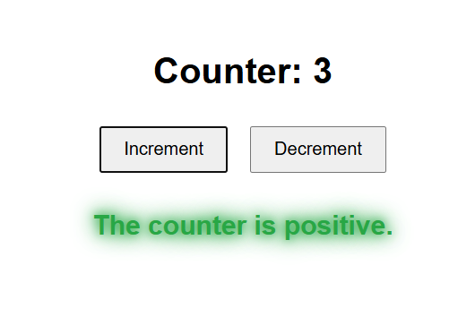

# Angular Counter 🔢

A simple counter application built with Angular as part of the **30 Days of Angular Projects** challenge.

This app demonstrates:
- Two-way data binding
- Event handling with `(click)`
- Conditional rendering using `ngSwitch`
- Styling based on state (positive, neutral, negative)

---

## 📸 Screenshot



---

## 🚀 Live Demo

[Click here to see the live demo](https://Ahmad-889.github.io/angular-counter/)  

---

## 🛠️ Technologies Used

- Angular 19
- SCSS
- HTML & TypeScript
- Angular Directives: `ngSwitch`, `ngClass`

---

## 🧠 Features

- Counter initialized to `5`
- **Increment** and **Decrement** buttons
- Dynamic status message:
  - Positive ➕
  - Neutral ➖
  - Negative ➖
- State-based color styles using `ngClass`

---

## 🏁 Getting Started

1. Clone the repo:

```bash
git clone https://github.com/Ahmad-889/angular-counter.git
cd angular-counter
